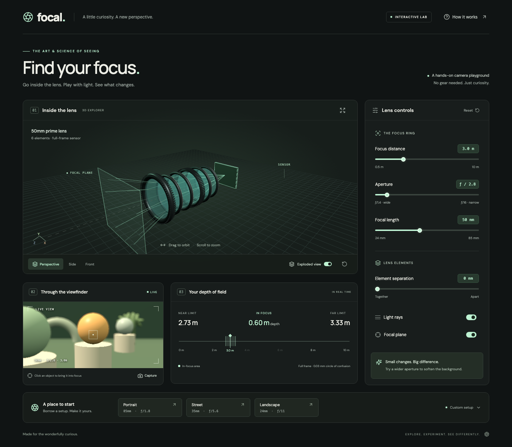

# Focal — interactive camera lab

[](https://github.com/Hostlife22/focal/actions/workflows/ci.yml)
[](LICENSE)

Explore focus, aperture and focal length with a six-element 3D lens, a live viewfinder and depth-of-field calculations. Built with React 19, strict TypeScript, Vite 7 and Three.js.

**[Open the camera lab](https://hostlife22.github.io/focal/)** · [Contribute](CONTRIBUTING.md) · [Accessibility](ACCESSIBILITY.md) · [Security](SECURITY.md)

This repository previously hosted an ESLint/Prettier configuration project. Its current product is Focal; it does not install or extend Airbnb's ESLint configuration.

[](https://hostlife22.github.io/focal/)

## Start locally

Use Node.js 22.22.0 or a newer Node 22 release and npm. `.nvmrc` selects the tested version.

```sh
git clone https://github.com/Hostlife22/focal.git
cd focal
nvm use
npm ci
npm run dev
```

Open the address printed by Vite. WebGL and hardware acceleration are needed for the two 3D views. Without WebGL, each view displays an explanation; controls and numeric depth-of-field results remain available.

## Explore

- Orbit and zoom the lens, or choose perspective, side and front views.
- Change focus distance (0.5–10 m), aperture (f/1.4–f/16), focal length (24–85 mm) and element separation (0–40 mm).
- Toggle light rays and the focal plane, and assemble or explode the lens.
- Click an object in the viewfinder to focus; the focus-distance slider provides a keyboard alternative.
- Try Portrait, Street and Landscape presets. Capture downloads a PNG locally.
- Reset the lab or open “How it works” for help.

Depth-of-field limits use a thin-lens approximation with a 0.03 mm circle of confusion for full-frame sensors. The lens assembly and ray paths are illustrations rather than a physically traced compound lens. Element separation changes only the diagram. BokehPass provides an artistic preview rather than a calibrated optical simulation.

## Commands

| Command                | Purpose                                                 |
| ---------------------- | ------------------------------------------------------- |
| `npm run dev`          | Development server                                      |
| `npm run typecheck`    | Strict TypeScript validation                            |
| `npm run lint`         | Type-aware ESLint, React Hooks and refresh checks       |
| `npm run format`       | Format source, configuration and documentation          |
| `npm run format:check` | Verify Prettier formatting                              |
| `npm test`             | Node tests for depth-of-field behavior                  |
| `npm run check`        | Formatting, lint, types and tests                       |
| `npm run build`        | TypeScript validation and production build into `dist/` |
| `npm run preview`      | Preview the production build                            |

The default local base path is `/`. GitHub Pages builds with `VITE_BASE_PATH=/focal/`. Preview that build at the same path.

## Documentation

- [Architecture and optical model](docs/architecture.md)
- [Validation and manual regression checks](docs/validation.md)
- [Deployment and SEO](docs/deployment.md)
- [Contributing and code style](CONTRIBUTING.md)
- [Security and privacy](SECURITY.md)
- [Accessibility support and limitations](ACCESSIBILITY.md)

## CI and deployment

GitHub Actions runs `npm ci`, `npm run check` and `npm run build` for pull requests and pushes to `main`. Pages rebuilds and deploys the exact commit after successful CI on a push to `main`; pull requests do not publish. Builds use the committed lockfile and Node version.

Scenes and the favicon are generated from code without downloaded models or textures. Typography uses Google Fonts with system fallbacks; see [security and privacy](SECURITY.md). Project code is available under the [MIT license](LICENSE); dependencies retain their own licenses.
